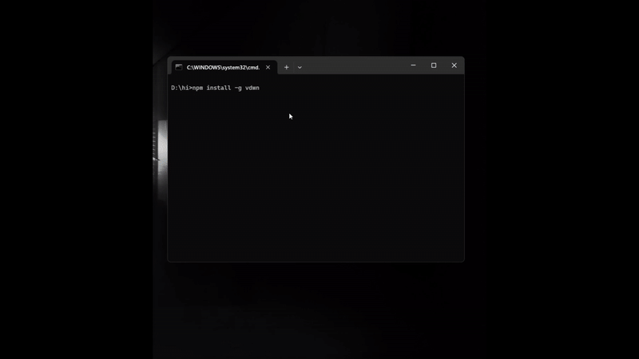

# vdwn

**vdwn** is a simple yet powerful interactive CLI wrapper that makes it easy to download videos and audio from YouTube and other supported sources. By wrapping powerful tools like yt-dlp and ffmpeg, it automates the installation of required dependencies and offers a smooth, user-friendly experience.



## Features

* Download full videos or audio-only tracks from YouTube and other URLs
* Select video quality: 1440p, 1080p, 720p, or best available
* Automatic installation of dependencies (`yt-dlp`, `ffmpeg`) using **Winget on Windows, Homebrew on macOS, and apt, dnf, or pacman on Linux.**
* Displays download progress with a clear progress bar
* Save output to a custom directory of your choice

## Requirements

* **Node.js** v18 or later
* **Windows** (Winget required for automatic dependency installation), macOS, or Linux

## Installation

Install globally from your project directory:

```bash
npm install -g vdwn
```

## Usage

Start the CLI with:

```bash
vdwn
```

Follow the prompts to:

1. Enter a video or playlist URL
2. Choose whether to download as video or audio
3. Select quality options
4. Specify the output directory

## Example

```bash
vdwn
# Enter URL: https://www.youtube.com/watch?v=dQw4w9WgXcQ
# Select: Audio-only
# Output: C:\Users\You\Downloads
```

## License

This project is licensed under the [MIT License](LICENSE).
